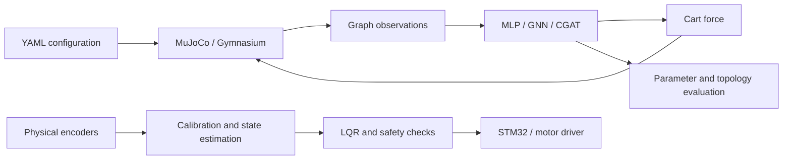

# Inverted Pendulum Control · Graph RL & Embedded LQR

**Learning to balance changing mechanical systems, from MuJoCo simulation to a physical three-link controller.**

This project explores whether graph-structured reinforcement learning policies can adapt to changes in pendulum length, mass, and link count. It combines a custom simulator, DQN and PPO baselines, physics-informed graph attention, an out-of-distribution evaluation suite, and a separate LQR control stack for an STM32-based cart-pendulum prototype.

[Demo video](https://youtu.be/ukRrmbrJezs) · [Technical walkthrough](https://youtu.be/omyPsI9fVvs) · [Architecture](docs/ARCHITECTURE.md) · [Setup & experiments](SETUP.md) · [Physical controller](traditional/README.md)

## Engineering highlights

- **Variable-topology simulation:** generate MuJoCo models at episode reset, randomizing link count, rod dimensions, and cart mass.
- **Graph observations:** encode the cart and joints as nodes, with bidirectional edges carrying link geometry and mass. Padding and masks support batches of different chain lengths.
- **Physics-informed policies:** coupled graph attention (CGAT) adds an analytic inertia-coupling bias to learned attention, with gravity and energy-based variants and matched ablations.
- **Controlled comparisons:** MLP, message-passing GNN, and graph-transformer policies share DQN or PPO training paths; evaluations sweep physical parameters and topology.
- **Physical control implementation:** derive multi-link dynamics, solve the discrete Riccati equation, convert encoder counts into state, and apply bounded force/PWM commands with fault checks. Python and portable C implementations are included.

## System overview



The simulation and physical-control paths share mechanical concepts but are separate implementations. Deployment of an RL policy to the real robot is not implemented here.

## Run it locally

Python 3.12 is the tested interpreter. The checks and short training run work on CPU without a display or robot.

```bash
git clone https://github.com/harshith998/ICGN-Inverted-Pendulum-RL.git
cd ICGN-Inverted-Pendulum-RL
python3.12 -m venv .venv
source .venv/bin/activate
python -m pip install -r requirements-dev.txt

# Numerical physics, policy gradients, training math, and controller checks
python -m pytest -q

# Short workflow check; not a trained performance benchmark
MPLBACKEND=Agg python -m training.train_cgat \
  --config configs/smoke.yaml --variant base --seed 42 --no-show
```

For full training, use `configs/default.yaml` or `configs/cgat_3link.yaml`. See [SETUP.md](SETUP.md) for model selection, evaluation, optional visualization, and hardware setup.

## Code map

| Location | Responsibility |
|---|---|
| [`env/`](env/) | MJCF generation, domain randomization, rewards, Gymnasium interface |
| [`graph/`](graph/) | Physical state → normalized graph features |
| [`models/`](models/) | DQN/PPO policies and CGAT variants |
| [`training/`](training/) | Training entry points and shared PPO utilities |
| [`eval/`](eval/) | Parameter sweeps, topology tests, adaptation, experiment analysis |
| [`benchmarks/`](benchmarks/) | Reusable task definitions and reference-normalized metrics |
| [`traditional/`](traditional/) | Physical-model LQR, serial interface, STM32 C control core |
| [`configs/`](configs/) | Main configurations; research variants in `experiments/` |
| [`tests/`](tests/) | Numerical and behavioral regression tests |

For a focused review, start with [`env/pendulum_env.py`](env/pendulum_env.py), [`graph/graph_builder.py`](graph/graph_builder.py), [`models/cgat/_physics.py`](models/cgat/_physics.py), and [`traditional/model.py`](traditional/model.py).

## Scope and evidence

The default training distribution covers **1–3 links**, link lengths **0.3–1.2 m**, link masses **0.1–2.0 kg**, and cart masses **0.5–3.0 kg**. Its 1–3-link topology sweep is an in-distribution comparison; it does not establish transfer to unseen topologies. Graph encoders support variable graph sizes, while fixed-capacity MLP baselines depend on their configured padding size.

Tests validate implementation behavior and numerical mechanics. Short smoke runs validate the training pipeline; they do not establish a model ranking or control success rate. Generated plots, caches, raw results, and checkpoints are intentionally excluded from version control. The repository makes no quantitative performance or research-priority claims without reproducible supporting measurements.

The physical controller is a **prototype**: calibration values are examples, board integration includes unfinished HAL hooks, and software tests do not establish real-robot stability. See the [hardware status and bring-up guide](traditional/README.md).

## Contributions

**Harshith:** environment and graph representation, training/evaluation infrastructure, graph-transformer development, and integration of the research system. **Rohan:** initial MLP and GNN notebook experiments, subsequently adapted into this codebase. Detailed component ownership and AI-assistance disclosures are preserved in [ATTRIBUTION.md](ATTRIBUTION.md).
